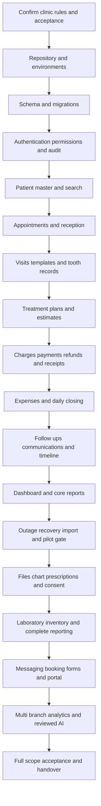
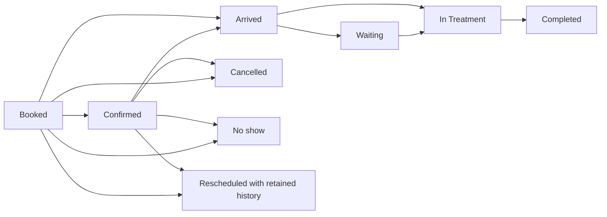

# Dental Clinic Software End to End Implementation Flow

Version 1.0 · 26 September 2026

## Purpose and scope

This is the implementation guide for the expanded Dental Clinic Software PRD, covering V1, V1.5, V2 and V3. Follow the phases in dependency order and check off tasks only after their acceptance checks pass. The guide describes work to be implemented; unchecked tasks are not claims of existing functionality.

You are building solo with AI assistance from a fresh codebase. The seven-day sequence at the end targets a core demonstration. Full implementation follows the complete flow below. Detailed estimates and the original section-by-section coverage map are in the companion `Dental_Clinic_Implementation_Plan.md` file.

Framework, provider, jurisdiction and clinic configuration are not yet confirmed. The proposed structure is framework-neutral: one web application, a relational database, private file storage and background jobs. Route names, entities and state machines below are implementation proposals to validate with the clinic.

## 1 Overall implementation order



Security, audit, testing and backup work begin with the foundation and continue through every phase. They are not end-of-project additions. Initialize file-storage infrastructure early; enable clinical file workflows in Phase 14 and expense attachments once that shared service is ready.

## 2 Build each feature using the same sequence

1. Identify PRD requirement IDs, user role, input fields and expected output.
2. Write normal, failure and unauthorized-use acceptance examples.
3. Add the schema migration and constraints.
4. Implement server validation, authorization and business rules.
5. Add atomic writes, audit events and concurrency handling where needed.
6. Expose a documented endpoint or equivalent server action.
7. Build the UI with loading, empty, validation, success and failure states.
8. Test through UI and direct API requests.
9. Demonstrate the feature on staging with synthetic data.
10. Commit the change and record evidence against the requirement.

Definition of done: persisted data survives reload; allowed roles can complete the workflow; forbidden roles cannot access it; relevant history is retained; meaningful tests pass; the feature is integrated with its dependent screens. A placeholder page or isolated CRUD form is not complete.

## 3 Phase 0 Confirm the clinic contract

**PRD:** 1–3, 27–28, 31–34. **Dependency:** none.

- [ ] Confirm dentists, chairs, branches, users and schedules.
- [ ] Collect anonymized patient cards, notes, receipts, consent forms, lab slips and inventory examples.
- [ ] Confirm mandatory demographics, medical history and alert fields.
- [ ] Confirm tooth numbering system and adult/pediatric representation.
- [ ] Confirm procedure catalog, durations, prices and routine templates.
- [ ] Agree discount, refund, deposit, partial-payment and approval rules.
- [ ] Define routine follow-up/recall types and responsible staff.
- [ ] Define timezone, currency, business-day cutoff and report meanings.
- [ ] Confirm devices, browsers, printers and internet-outage requirements.
- [ ] Confirm actual privacy, retention, export, communication and hosting policies before using real patient data.
- [ ] Decide active-patient migration scope and handling of opening balances.
- [ ] Record which optional features are selected: chairs, deposits, material consumption and utilization.
- [ ] Define acceptance stories for broad roadmap items such as patient portal, AI assistance and forecasting.

**Outputs:** decision register, approved field list, permissions matrix, state transitions and requirement backlog. Unresolved choices get an owner and due date; do not invent clinic approval.

## 4 Phase 1 Repository and environments

**Dependency:** initial clinic contract.

- [ ] Initialize repository, formatter, linter, type checking and test runner.
- [ ] Create separate development, staging and production environments.
- [ ] Configure database, authentication and private storage credentials through environment secrets.
- [ ] Add `.env.example` containing variable names and safe placeholders only.
- [ ] Add migrations, seed command, synthetic fixtures and repeatable local startup instructions.
- [ ] Add CI checks for formatting/lint, types, tests and application build.
- [ ] Deploy a minimal authenticated page to staging.
- [ ] Configure health checks and redacted error logging.
- [ ] Create a requirement tracker with status, dependency, test evidence and release.

Proposed repository layout; these are planned paths, not files already created by this guide:

```text
src/
  ui/                  shared forms tables dialogs navigation
  modules/
    identity/          users roles memberships sessions
    patients/          demographics alerts search history
    scheduling/        calendar appointments transitions
    clinical/          visits notes templates teeth chart
    treatment-plans/   plans items estimates
    finance/           charges payments refunds receipts closing
    follow-ups/        follow-ups recalls communications
    files/             uploads tagging authorized downloads
    prescriptions/     drafts approvals print
    consents/          form versions signatures
    laboratory/        cases vendors delivery
    inventory/         items lots movements suppliers
    reporting/         dashboard reports exports
    portal/            patient identity booking forms
    automation/        outbox jobs providers webhooks
  shared/              authorization validation audit money time
db/
  migrations/
  seeds/
tests/
  unit/
  integration/
  e2e/
docs/
  decisions.md
  requirements.md
  permission-matrix.md
  api-contracts.md
  deployment.md
  recovery.md
```

**Gate:** a new checkout starts using documented steps, tests run, and staging is reachable.

## 5 Phase 2 Database and shared contracts

**PRD:** 24–26. **Dependency:** Phase 1.

Create tables incrementally with the owning module; establish the shared identifiers and scoping conventions first.

| Group | Proposed entities |
|---|---|
| Organization | clinics, branches, users, memberships, roles, permissions, dentists, chairs, clinic_hours |
| Patient | patients, patient_identifiers, medical_history, patient_alerts, communication_preferences |
| Reception | appointments, appointment_events, procedures |
| Clinical | visits, note_revisions, diagnoses, performed_procedures, tooth_findings, clinical_templates |
| Plans | treatment_plans, treatment_plan_items, plan_item_events, estimate_versions |
| Finance | charges, charge_items, credit_notes, payments, payment_allocations, refunds, receipts, expenses, expense_payments, cash_movements, cash_closings |
| Operations | follow_ups, communication_events, timeline_events |
| Files and approvals | files, file_links, prescriptions, prescription_items, prescription_approvals, consent_templates, consent_versions, signed_consents |
| Lab and supplies | labs, lab_cases, lab_case_events, suppliers, inventory_items, inventory_lots, stock_movements, purchases |
| Platform | audit_events, idempotency_records, outbox_events, job_attempts, import_batches, export_jobs |

Shared rules:

- [ ] Give records immutable internal IDs; keep patient/receipt display numbers separate.
- [ ] Scope patient ownership to clinic; scope appointments, finance, stock and staff access to branch where appropriate.
- [ ] Validate related records belong to the same authorized clinic/branch; never trust a client-supplied scope alone.
- [ ] Store event timestamps consistently and render using clinic timezone; retain date-only values such as DOB as dates.
- [ ] Represent money with fixed decimal precision or integer minor units, with a defined currency.
- [ ] Add foreign keys, required checks, scoped uniqueness and indexes for real query patterns.
- [ ] Use a version field for records that need optimistic concurrency checks.
- [ ] Archive patients; amend finalized clinical records; reverse posted finances. Do not apply a universal delete operation.
- [ ] Define stable error codes: validation, unauthorized, forbidden, not found, duplicate candidate, conflict, retryable failure.

Write services around business actions such as `rescheduleAppointment`, `finalizeVisit`, `postPayment` and `approveClosing`, rather than allowing arbitrary updates to status columns.

**Gate:** migrations run against an empty database; invalid references and cross-clinic relationships are rejected; seed data is repeatable.

## 6 Phase 3 Identity permissions and audit

**PRD:** 3, 24, 28. **Dependency:** shared schema.

- [ ] Integrate established authentication, session expiry and configured security policy.
- [ ] Seed owner/admin, dentist, receptionist, assistant and accountant roles.
- [ ] Separate demographic, clinical, prescription, financial, refund, export and administrative permissions.
- [ ] Check permission and record scope on every endpoint, background action and file request.
- [ ] Ensure search results, dashboard counts and timeline summaries do not reveal restricted information.
- [ ] Record actor, scope, action, entity, time, request ID and relevant change details in protected audit history.
- [ ] Write business changes and required audit entries in the same transaction.
- [ ] Prevent ordinary application roles, including owner/admin, from editing or deleting audit history.
- [ ] Audit role changes and authorized exports; restrict sensitive audit details by role.

| Role | Proposed default access |
|---|---|
| Owner/admin | Clinic administration and oversight; no silent history erasure |
| Dentist | Clinical documentation, plans, prescriptions, consent and permitted finance views |
| Receptionist | Demographics, booking, arrivals, payments/receipts and follow-ups; restricted notes excluded |
| Assistant | Selected support fields/files/statuses and permitted inventory; no unauthorized prescriptions/finance |
| Accountant | Financial records, expenses and reports; clinical notes excluded |

**Gate:** test both permitted and denied requests for every role, including direct requests using guessed record IDs.

## 7 Phase 4 Patient registration and search

**PRD:** 6, 23. **Dependency:** identity and audit.

**Flow:** search ID/name/phone → inspect candidates → open existing record or explicitly create → record demographics/history/preferences → show patient workspace.

- [ ] Generate unique patient display ID.
- [ ] Implement name, phone, alternate contact, DOB or known age, gender where appropriate, address and emergency contact.
- [ ] Implement medical/dental history, medications, allergies and clinically relevant tobacco history.
- [ ] Record communication consent/preferences and opt-out.
- [ ] Add active/inactive/archived status.
- [ ] Normalize phone for search but permit separate family members to share it.
- [ ] Show duplicate candidates before creation; require explicit authorized override with reason when proceeding.
- [ ] Add recent patients and Quick Add navigation, filtered by authorization.
- [ ] Keep unknown DOB unknown; do not derive a fictitious birth date from approximate age.

**Example contracts:** `GET /patients?query=...`, `POST /patients`, `GET /patients/:id`, `PATCH /patients/:id`, `POST /patients/:id/archive`.

**Gate:** existing patient found without duplication; shared phone supported; unauthorized clinical history omitted from reception response.

## 8 Phase 5 Appointment and reception workflow

**PRD:** 5. **Dependency:** patients, procedures, dentists and optional chairs.



Validate permitted transitions with the clinic. Walk-in is an entry type displayed alongside lifecycle status, allowing a walk-in to also be waiting or in treatment.

- [ ] Build day/week views with hours, dentist, chair, duration, reason, notes and next action.
- [ ] Default duration from procedure; enforce permission for overrides.
- [ ] Check dentist and chair conflicts server-side within a concurrency-safe booking operation.
- [ ] Require permission and reason for overlap override; preserve audit evidence.
- [ ] Record confirmation, cancellation, no-show and reschedule history.
- [ ] Preserve old/new times when rescheduling; never discard original slot history.
- [ ] Show balance without automatically preventing care.
- [ ] Implement fast telephone booking and walk-in arrival.

**Example contracts:** `GET /appointments?from=...&to=...`, `POST /appointments`, `POST /appointments/:id/transition`, `POST /appointments/:id/reschedule`.

**Gate:** simultaneous booking attempts cannot silently create unauthorized overlaps; calendar and event history agree.

## 9 Phase 6 Visits tooth records and templates

**PRD:** 8–9, 11. **Dependency:** patients and appointment lifecycle.

**Flow:** open patient → review alerts/history → start visit → record findings/procedures → review → finalize → amend if needed.

- [ ] Record complaint, diagnosis/findings, tooth numbers, planned/performed procedure, materials/technique, notes, instructions, outcome and next step.
- [ ] Record responsible clinician, date/time and revision history.
- [ ] Save draft separately from finalized note; only authorized clinician can finalize.
- [ ] Make final-note correction an attributed amendment retaining the previous record.
- [ ] Store tooth number with numbering system and dentition.
- [ ] Add dentist-editable, versioned templates for RCT, extraction, crown/bridge, scaling/perio, implant, orthodontic visits and custom procedures.
- [ ] Start the demo with a small approved template set; retain the full library/editor as unfinished until implemented.
- [ ] Copy template content into the visit so later template edits cannot rewrite old notes.
- [ ] Link next appointment or follow-up to the visit.

**Example contracts:** `POST /visits`, `PATCH /visits/:id/draft`, `POST /visits/:id/finalize`, `POST /visits/:id/amendments`, `GET /patients/:id/tooth-history`.

**Gate:** clinician attribution survives edits; two editors do not silently overwrite each other; a changed template leaves previous visits intact.

## 10 Phase 7 Treatment plans and estimates

**PRD:** 10. **Dependency:** patient, procedure catalog and clinical links.

- [ ] Keep plans separate from completed visit notes.
- [ ] Add tooth, procedure, estimated price, priority and notes per item.
- [ ] Support Proposed, Explained, Accepted, Rejected, Deferred, In Progress and Completed.
- [ ] Derive overall progress from item states; show accepted, completed and remaining work.
- [ ] Link performed procedures to plan items without automatically completing unrelated items.
- [ ] Create versioned quotations with line totals, discounts, total and validity.
- [ ] Preserve accepted price snapshot when catalog prices change.
- [ ] Generate printable/downloadable estimates and audit permitted sharing.
- [ ] Keep declined/deferred proposals visible without automatically blocking care.

**Gate:** a partially completed multi-item plan remains partially complete; old estimates retain their original content and totals.

## 11 Phase 8 Charges payments receipts and refunds

**PRD:** 15. **Dependency:** patient, role controls and optional visit/plan links.

**Flow:** post charge → apply authorized discount → record payment → allocate payment → issue receipt → calculate balance → handle corrections through explicit financial entries.

- [ ] Implement charge items and discounts with authorization and reason rules.
- [ ] Record cash/card/bank transfer/Easypaisa/JazzCash/configured methods. Recording these methods does not integrate a payment gateway.
- [ ] Support partial payments, allocations, unallocated patient credit and payment history.
- [ ] Create immutable receipt identifiers and printable/digital receipt output.
- [ ] Implement refunds with amount, original payment, allocation reversal, reason, authorizer and timestamp.
- [ ] Use credit notes when reducing a charge; do not confuse credit notes with returned money.
- [ ] Correct posted entries through traceable reversals/replacements.
- [ ] Add optional deposit/minimum-payment policies only if selected.
- [ ] Restrict manual digital sharing by permission and communication preference.

Atomic payment operation:

```text
Authenticate and authorize actor
Validate patient, amount, currency, method and target charges
Start database transaction
  Claim idempotency key scoped to actor/action and request payload
  If completed request already exists, return its original result
  Reject reuse of the same key with a different payload
  Lock affected financial records in a consistent order
  Recalculate remaining allocatable amounts
  Insert payment and allocations
  Insert receipt metadata and required audit event
  Save original response against idempotency key
Commit transaction
Render receipt from committed immutable data
Retry receipt rendering without reposting payment if rendering fails
```

**Balance example:** charge 10,000 − discount 1,000 − allocated payment 4,000 = 5,000 due. Refunding 1,000 of that payment reverses its allocation, producing 6,000 due. If a 1,000 service credit is also posted, due returns to 5,000.

**Gate:** duplicate submits post once; concurrent refunds cannot exceed refundable funds; reports reconcile to posted records; receipts remain reproducible.

## 12 Phase 9 Expenses and daily cash closing

**PRD:** 16–17. **Dependency:** posted finance records.

- [ ] Add category, amount, payment method, payee/supplier, date and notes.
- [ ] Include materials, lab, rent, utilities, salaries, maintenance, marketing and miscellaneous categories.
- [ ] Add permissions/approval and invoice/receipt attachments through the shared file service.
- [ ] Keep recorded expense separate from its payment so cash reports count paid amounts correctly.
- [ ] Aggregate collections/refunds by method and business date.
- [ ] Record opening float, actual counted cash and documented cash movements.
- [ ] Require explanation for variance; submit cashier closing for admin approval.
- [ ] Lock approved closing snapshot and retain its audit history.
- [ ] Post later adjustments without changing the original approved snapshot.
- [ ] Create daily/monthly expense reports.

```text
Expected cash = opening float + cash receipts - cash refunds
                - cash expenses + other cash in - other cash out
Variance = counted cash - expected cash
```

Define transaction inclusion and cutoff rules once, and avoid counting an expense both as an expense payment and an additional cash movement.

**Gate:** a synthetic day including cash/non-cash payments, refund and expenses reconciles exactly; approved days cannot be silently edited.

## 13 Phase 10 Follow ups communication history and timeline

**PRD:** 7, 20–21, 23. **Dependency:** patients, appointments, visits and finance events.

- [ ] Add due-today/upcoming/overdue lists, responsible staff and notes.
- [ ] Support post-extraction, RCT, crown delivery, implant review, suture removal, orthodontic adjustment, scaling recall, periodic check-up and custom types.
- [ ] Support Due, Contacted, Booked, Completed, Closed and Unable to Reach.
- [ ] Link booked follow-up to appointment; do not equate appointment creation with completed care.
- [ ] Record communication date/time, channel, purpose, sender and outcome.
- [ ] Add approved templates for confirmation, reminder, missed appointment, follow-up, estimate, receipt and recall.
- [ ] Respect preferences and opt-out before any controlled outbound action.
- [ ] Populate chronological timeline from appointments, visits, diagnoses, procedures, plans, payments/receipts and follow-ups/communications.
- [ ] Register prescriptions, images, consents and labs in the same timeline when those modules are implemented.
- [ ] Apply permission filtering before returning timeline events and summaries.

**Gate:** a complete patient journey appears in order; restricted clinical information is absent from receptionist/accountant responses.

## 14 Phase 11 Dashboard reports and navigation

**PRD:** 4, 22–23, 27. **Dependency:** source modules; add lab/stock metrics once available.

- [ ] Show role-appropriate schedule, waiting/arrived/in-treatment/completed counts and next actions.
- [ ] Show no-shows/cancellations/reschedules, collections, balances, refunds and expenses.
- [ ] Add due/overdue follow-ups/recalls, lab and stock alerts, and appropriate medical alerts.
- [ ] Add Quick Add patient, appointment, walk-in, payment and follow-up actions.
- [ ] Add global patient search, recent patients and operational filters.
- [ ] Implement the complete report catalog below, with date range and authorized scope.

| Report | Definition to validate |
|---|---|
| Daily/weekly/monthly appointments | Count by agreed event/date and status |
| New versus returning patients | Proposed definition based on first completed visit |
| No-shows cancellations reschedules | History-aware; avoid double-counting revised bookings |
| Procedures by type and dentist | Performed procedures with responsible clinician |
| Accepted deferred completed plans | Item/plan definitions explicit |
| Daily/monthly collections by method | Posted payments and separately identified refunds |
| Outstanding balance and aging | Unsettled charges by approved due-date buckets |
| Discounts and refunds | Traceable posted amounts with authorization |
| Expenses and net financial summary | Clearly labeled accounting basis; not unsupported profit claims |
| Follow-up/recall performance | Due, contacted, booked and completed measures with denominators |
| Lab and inventory | Live module status and movement-derived quantities |
| Chair/doctor utilization | If applicable, actual agreed occupied time over available time |

**Gate:** every report reconciles to known fixtures and source transactions, respects timezone boundaries, and obeys clinical/financial access separation. Unimplemented metrics must not display misleading zeroes.

## 15 Phase 12 Outage handling backups and recovery

**PRD:** 25, 33. **Dependency:** implement foundation early; validate against working core.

Proposed essential outage scope requires clinic agreement: approved cached schedule plus existing clinical drafts; no offline payments, new bookings, patient creation, signed notes or permission changes.

- [ ] Cache only authorized essential information and display cache age/offline status.
- [ ] Persist in-progress drafts with explicit saving/local-only/synced/failed indicators.
- [ ] Handle unavailable storage and quota failures visibly.
- [ ] Define cache expiry, managed-device policy, logout and pending-draft handling.
- [ ] On reconnect, reauthorize, submit stable operation ID and base version, detect conflicts and request explicit resolution.
- [ ] Keep unsynced drafts until server acknowledgment; do not blindly overwrite newer notes.
- [ ] Test outage during typing, refresh, repeated retries and competing edits.
- [ ] Configure encrypted automatic database/file backups and failure alerts.
- [ ] Agree recovery point and recovery time targets; select backup frequency/PITR accordingly.
- [ ] Restore into a separate environment; verify records, totals, permissions and attachments.
- [ ] Document recovery commands and measure actual recovery time.

Local browser persistence is not a backup and cannot guarantee survival of device loss, cleared browser data or storage eviction. A disconnected device also cannot instantly receive permission revocation; the accepted device policy must address that limitation.

**Gate:** the agreed temporary-outage scenario loses no already-entered information and creates no duplicate/conflicting final records; actual restore succeeds within approved targets.

## 16 Phase 13 Import and core pilot

**PRD:** 31–34. **Dependency:** core acceptance, recovery and clinic policy.

- [ ] Map source patient fields and verified opening balances to import schema.
- [ ] Stage rows, validate values and present duplicate candidates before committing.
- [ ] Assign import batch/source identifiers to support idempotency and reconciliation.
- [ ] Dry-run and compare counts, rejected rows and totals with source data.
- [ ] Commit approved data with audit evidence; do not import the same opening balance twice.
- [ ] Test reception → visit → plan → payment → receipt → follow-up → daily closing.
- [ ] Test role denial, concurrency, amendments, financial retries and report reconciliation.
- [ ] Train staff on actual devices/printer using synthetic data first.
- [ ] Obtain clinic acceptance before a small controlled real-data pilot.

**Gate:** no unresolved required core-workflow, access-control, clinical attribution, financial or data-loss defect. If a required gate fails, remain on synthetic data.

## 17 Phase 14 Files visual chart prescriptions and consent

**PRD:** 9, 12–14. **Dependency:** clinical records, permissions and private storage.

### Files and imaging

- [ ] Implement authorized upload preparation, type/content/size validation, private storage, upload completion and file metadata.
- [ ] Keep incomplete/quarantined uploads unavailable; clean up orphaned uploads through a controlled job.
- [ ] Add clinical photo categories pre-treatment/during/post-treatment and dates.
- [ ] Add IOPA, OPG, bitewing, CBCT and configurable radiograph categories, plus PDF/documents.
- [ ] Link files to patient, tooth, visit and treatment as appropriate.
- [ ] Implement before/after comparison and permission/consent-controlled print/download/share.
- [ ] Clarify CBCT attachment storage versus a diagnostic DICOM viewer; the PRD does not specify a diagnostic viewer.

### Visual dental chart

- [ ] Validate numbering/dentition design with dentist before drawing the interactive chart.
- [ ] Support adult and pediatric tooth selection and tooth-specific history.
- [ ] Add caries, restoration, missing, RCT, crown, implant, extraction planned/completed, fracture and custom findings.
- [ ] Link tooth notes, treatment and files without changing historical numbering interpretation.

### Prescriptions

- [ ] Add medication name, strength, dose, frequency, duration and instructions.
- [ ] Require explicit responsible-dentist review/approval before final print/share.
- [ ] Preserve approved version and history; corrections create a new attributable version.
- [ ] Produce printable PDF/receipt-style prescription and timeline event.
- [ ] Never independently choose medication or dosage.

### Consent

- [ ] Version configurable forms for extraction, RCT, implant, surgery, crown/bridge, orthodontics, whitening and custom procedures.
- [ ] Capture patient/dentist signature fields or agreed signed-form capture method.
- [ ] Store the exact signed content/version, timestamp and treatment/visit link.
- [ ] Prevent overwrite of signed historical consent; retain replacement versions separately.

**Gate:** unauthorized files are inaccessible; pediatric/adult tooth history is correct; unapproved prescriptions cannot appear approved; signed records remain unchanged after template edits.

## 18 Phase 15 Laboratory and inventory

**PRD:** 18–19. **Dependency:** patients, treatment, files, finance and supplier records.

### Laboratory flow

`To Send → Sent → In Lab → Ready → Received → Delivered`

- [ ] Record patient/treatment/tooth, lab, case type, material, shade, instructions and attachments.
- [ ] Record sent/expected/received dates, cost and payment status.
- [ ] Preserve status changes and alert on overdue expected dates.
- [ ] Add patient timeline history and dashboard pending-case counts.
- [ ] Link lab cost/payment to finance once; prevent duplicate expense records.

### Inventory flow

`Purchase or opening stock → stock in → lot balance → stock out → adjustment if needed → alerts and reporting`

- [ ] Record item/category/unit/minimum level/supplier and purchase price.
- [ ] Track batch/lot/expiry where relevant.
- [ ] Derive quantity from stock movements, including opening balances and attributed adjustments.
- [ ] Define unit conversions and negative-stock policy; validate concurrent withdrawals.
- [ ] Add low-stock and expiry alerts, inventory reports and supplier purchase history.
- [ ] If selected, link procedure consumption to one idempotent stock movement; amendments do not consume materials twice.

**Gate:** movements reconcile to stock, expiry alerts work, lab costs reconcile to finance, and all new events appear in authorized timeline/report views.

## 19 Phase 16 Messaging and recall automation

**PRD:** 21, 29 V2. **Dependency:** preferences, templates, follow-ups and provider approval.

**Flow:** business event → outbox record → eligible scheduled job → consent recheck → provider request → delivery callback → communication history.

- [ ] Confirm provider availability, credentials and clinic-approved templates.
- [ ] Add transactional outbox so jobs are created reliably alongside business changes.
- [ ] Recheck appointment version/status, consent and opt-out immediately before sending.
- [ ] Cancel/supersede reminders after rescheduling or cancellation.
- [ ] Add bounded retries, backoff, failed-job visibility and duplicate-send protection.
- [ ] Verify webhook authenticity and deduplicate provider events.
- [ ] Handle ambiguous provider timeouts carefully; use provider idempotency/status lookup where supported rather than blindly resending.
- [ ] Record attempts and delivery outcomes without marking provider acceptance as confirmed delivery.
- [ ] Implement approved automated recall creation/contact rules and manual pause controls.
- [ ] Keep appointment reminder and recall policies configurable, including contact windows.

**Gate:** opted-out patients receive no automated message; replayed events do not resend; stale appointments are not reminded; failures are visible to responsible staff.

## 20 Phase 17 Online booking forms and patient portal

**PRD:** 29 V2. **Dependency:** mature scheduling, identity, authorization and consent rules.

- [ ] Agree exactly what a patient may view/download/request and whether bookings are automatic or staff-approved.
- [ ] Implement separate patient identity and verified mapping to patient record; never link accounts by name alone.
- [ ] Define verified guardian/dependent access explicitly if required.
- [ ] Expose only approved availability, never another patient's appointment information.
- [ ] Revalidate slots server-side when committing online bookings.
- [ ] Add rate limits and duplicate-request protection.
- [ ] Save digital patient forms as submissions for staff review; do not overwrite signed clinical records automatically.
- [ ] Implement authorized appointment/history/document views and preference management according to approved portal scope.
- [ ] Record booking/form/portal events in appropriate staff workflows and audit history.

**Gate:** patient A cannot access patient B by changing an identifier; simultaneous bookings respect clinic conflict rules; submitted forms retain review history.

## 21 Phase 18 Multi branch and advanced features

**PRD:** 26, 29 V3. **Dependency:** accepted core and operational modules.

### Multi branch

- [ ] Add separate schedules, chairs, staff membership and financial reporting per branch.
- [ ] Define shared patient access policy independently from local visit/financial access.
- [ ] Scope caches, jobs, exports and analytics as well as normal API requests.
- [ ] Test cross-branch access denial and authorized shared patient views.

### Advanced analytics and finance

- [ ] Agree metric definitions, source records, accounting basis and drill-down behavior.
- [ ] Reconcile aggregates to operational records before releasing dashboards.
- [ ] Preserve branch/currency boundaries and restrict sensitive exports.

### Inventory forecasting

- [ ] Define forecast horizon, lead time, usable stock, expiry and replenishment assumptions.
- [ ] Establish a historical baseline and evaluate errors against actual consumption.
- [ ] Show insufficient-data states and assumptions; require review of purchase recommendations.

### AI assisted documentation

- [ ] Define permitted inputs, data handling, provider policy and review workflow before integration.
- [ ] Generate a draft with visible source context and provenance.
- [ ] Require dentist review before any clinical finalization; keep generated draft distinct from approved note.
- [ ] Prevent automatic diagnosis/treatment/prescription execution and medication/dose selection.
- [ ] Test fabricated facts, missing information, incorrect patient association and malicious instructions in uploaded content.
- [ ] Preserve reviewer edits and attributable final record; audit use without leaking sensitive content into ordinary logs.

**Gate:** each advanced feature has agreed measurable acceptance; a generic AI text box or chart does not fulfill an undefined roadmap feature.

## 22 Integration and release testing

Run these at the owning phase and repeat affected cases when dependencies change.

| Test layer | Required examples |
|---|---|
| Business rules | Appointment transitions, duplicate warnings, plan completion, money calculations, stock quantities |
| Database/API integration | Role and scope checks, transaction rollback, idempotency, race conditions, audit persistence |
| End-to-end core | Find patient → book → arrive → review alerts → document → plan → charge/pay → receipt → follow-up → close |
| End-to-end clinical depth | Upload → tooth tag → chart → prescription approval → signed consent → protected timeline |
| End-to-end operations | Lab case delivery/payment; purchase/lot/consumption/expiry; full report reconciliation |
| Automation | Consent changes, retries, replayed callbacks, rescheduled appointments and failed delivery |
| Portal and branches | Patient isolation, membership changes, branch-scoped export/cache/job access |
| Reliability | Outage draft recovery, restore, backup alert, interrupted deployment and retry |
| Usability | Actual receptionist/dentist tasks, desktop/tablet, printer, required-field burden and readable alerts |

Proposed performance targets for clinic approval: returning-patient booking within 60 seconds; routine template-assisted note within 3 minutes; schedule p95 under 2 seconds on agreed hardware/network and declared data volume. Measure them; do not mark them passed from code inspection.

## 23 Production deployment flow

1. Freeze release scope and list the PRD requirements actually included.
2. Run build, automated tests, acceptance scenarios and reconciliation checks.
3. Review migration impact and take a verified pre-deployment backup.
4. Confirm production policies, credentials, access, monitoring and backup alerts.
5. Deploy backward-compatible migrations and the tested application version.
6. Run smoke tests for sign-in, role denial, search and permitted core actions.
7. Perform approved import; reconcile row counts and opening balances.
8. Train users and run a small controlled pilot.
9. Reconcile the first close and inspect errors, pending drafts and failed jobs.
10. Expand use only after acceptance; retain named support and recovery ownership.

If rollback is necessary after new transactions have been entered, preserve those records. Rolling back application code is different from restoring an old database. Do not erase post-deployment visits/payments to recover an earlier build.

## 24 Seven day implementation slice

This schedules the core demonstration only. Continue the remaining phases after the week; do not mark V1.5/V2/V3 complete from mock screens.

| Day | Implement first | Evidence |
|---|---|---|
| 1 | Decisions, repository, staging, initial schema, identity/permissions | Running staging and denied unauthorized request |
| 2 | Patient create/search and basic booking/arrival | Existing patient booked without duplication |
| 3 | Alerts, visit notes, tooth numbers, basic template and treatment items | Clinician-attributed visit and plan saved/reopened |
| 4 | Charges, partial payments, balance and printable receipt | Known arithmetic and duplicate-submit test pass |
| 5 | Follow-ups, manual communication, basic timeline/dashboard | Core patient journey demonstrated |
| 6 | Permission/audit tests, restore test and highest-risk fixes | Test evidence and honest outage/readiness gap list |
| 7 | Staff demonstration, fixes, requirement review and re-estimation | Working synthetic-data build and remaining backlog |

## 25 AI implementation task template

Use one bounded task at a time and review its actual result before starting a dependent task.

```text
Task:
PRD sections and requirement IDs:
Current phase and dependencies:
Relevant existing files and schema:
Authorized roles and forbidden actions:
Inputs and validation:
State transitions and business rules:
Required audit events:
Transaction/idempotency/concurrency requirements:
UI states:
Acceptance examples:
Tests to execute:

Implement this task using the existing project conventions.
Preserve unrelated work and historical records.
Do not replace working behavior with mock data.
Report changed files, test results and unresolved requirements.
Do not mark completion until acceptance checks pass.
```

## 26 Final handover checklist

- [ ] All PRD requirements have an implemented/tested status or an explicitly recorded unresolved status.
- [ ] Source repository and local setup instructions are complete.
- [ ] Database schema, migration history and environment-variable reference are documented.
- [ ] Roles, access rules and clinic configuration are documented.
- [ ] API contracts and important business rules are recorded.
- [ ] Staff guides cover reception, clinical work, payments/refunds, closing and downtime.
- [ ] Import counts/opening balances and report totals are reconciled.
- [ ] Backup/restore, deployment/rollback and incident procedures are tested.
- [ ] Provider configuration, scheduled jobs and failure handling have named owners.
- [ ] Clinical and owner acceptance evidence is retained.
- [ ] Full V1–V3 completion is claimed only after every selected requirement passes its agreed acceptance criteria.

## 27 PRD traceability index

| Source PRD sections | Implementation guide location |
|---|---|
| 1–2 Vision and goals | Purpose, Phase 0, acceptance and release gates |
| 3 Roles | Phase 3 |
| 4 Dashboard | Phase 11 |
| 5 Appointments | Phase 5 |
| 6 Patient master | Phase 4 |
| 7 Timeline | Phase 10 and later module event integration |
| 8 Visit records | Phase 6 |
| 9 Dental chart | Phase 6 tooth records and Phase 14 visual chart |
| 10 Plans and estimates | Phase 7 |
| 11 Templates | Phase 6 |
| 12–14 Prescriptions images consent | Phase 14 |
| 15 Payments | Phase 8 |
| 16–17 Closing and expenses | Phase 9 |
| 18–19 Lab and inventory | Phase 15 |
| 20 Follow-ups | Phase 10 |
| 21 Communication | Phases 10 and 16 |
| 22 Reports | Phases 11 and 18 |
| 23 Search/navigation | Phases 4 and 11 |
| 24 Security/audit | Phase 3 and every feature acceptance gate |
| 25 Reliability | Phase 12 and production deployment |
| 26 Multi-branch | Phase 2 scoping foundation and Phase 18 |
| 27 Usability/performance | Phase 11 and integration testing |
| 28 Privacy | Phases 0, 3, 12, 14, 16–18 |
| 29 Roadmap | Complete ordered flow, Phases 16–18 for V2/V3 |
| 30 Visit journey | Phases 4–11 and end-to-end tests |
| 31 Decisions | Phase 0 |
| 32 Rollout | Phase 13 and production deployment |
| 33 Acceptance | Feature gates and integration testing |
| 34 Core first principle | Dependency order, core pilot, then advanced modules |
