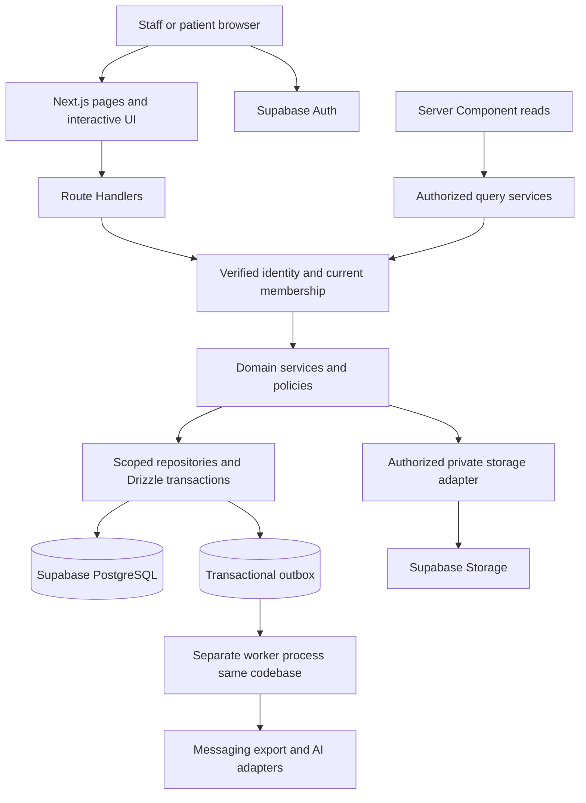

# Dental Clinic Next.js Technical Implementation Plan

Version 1.0 · 26 September 2026

## 1 Scope and decisions

This blueprint translates all 34 sections of the expanded dental clinic PRD into a Next.js application design and implementation backlog. It covers the repository, frontend, backend, database, permissions, workflows, jobs, tests and deployment. It is a proposed implementation specification; the application and infrastructure have not been created by this document.

Confirmed context: one developer with AI assistance, starting fresh, using Next.js. The seven-day milestone is the core demonstration defined in section 20. Full V1–V3 delivery requires the remaining milestones and their acceptance gates. Do not mark a module complete because its page exists.

Use this file as the technical architecture reference. It replaces the earlier guides' framework-neutral folder/API proposals; their PRD analysis and detailed clinic workflows remain useful background.

### Architecture decisions

| Concern | Decision |
|---|---|
| Application | One Next.js App Router application with TypeScript strict mode |
| Rendering | Server Components for authenticated initial reads; Client Components for interactive forms/calendar/chart |
| Styling | Tailwind CSS and shadcn/ui |
| API | Next.js Route Handlers under `/api/v1`; thin HTTP adapters over domain services |
| Database | Supabase-hosted PostgreSQL; application tables in a non-exposed `clinic_app` schema |
| ORM | Drizzle ORM with Postgres.js driver; reviewed Drizzle SQL migrations |
| Identity | Supabase Auth with `@supabase/ssr`; application memberships supply authorization |
| Files | Private Supabase Storage buckets; access issued by authorized server services |
| Validation | Zod request/DTO schemas; React Hook Form for complex client forms |
| Client server-state | TanStack Query for interactive lists/mutations; no general Redux store initially |
| Testing | Vitest for pure rules; real PostgreSQL integration tests; Playwright for browser workflows |
| Background work | PostgreSQL transactional outbox and a durable worker from the same repository |
| Offline | Explicitly scoped service worker/static cache and IndexedDB draft store; no generic API cache |
| Initial scope | Single clinic/branch operationally; schema and authorization support future branch separation |

Pin compatible stable package versions and the supported Node runtime at project creation, commit the lockfile, and record them in `docs/architecture/versions.md`. Do not use floating versions in CI/deployment. The paths below assume a Next.js version using `proxy.ts`; earlier versions use `middleware.ts`. Match the installed version rather than keeping both. [Next.js structure](https://nextjs.org/docs/app/getting-started/project-structure), [Supabase SSR setup](https://supabase.com/docs/guides/auth/server-side/nextjs).

shadcn provides a Next.js setup path; Zod provides runtime schemas; TanStack Query manages asynchronous client server-state. Their presence does not replace server-side business validation. [shadcn setup](https://ui.shadcn.com/docs/installation/next), [Zod](https://zod.dev/), [TanStack Query](https://tanstack.com/query/latest/docs/framework/react/overview).

## 2 System design and trust boundaries



There are two approved database access paths: authenticated server query services for reads and authenticated domain services for writes. Both use scoped repositories. Browser code does not query clinic tables using the Supabase Data API. Server Components call query services directly rather than making HTTP requests to their own application.

### Drizzle and Supabase authorization model

1. Put clinical/business tables in `clinic_app`, outside exposed Data API schemas. Disable the Data API when unused, or leave it enabled only for explicitly permitted unrelated schemas. Revoke application-schema grants from `anon`, `authenticated` and PUBLIC and set default privileges deliberately.
2. Use a dedicated non-owner `clinic_runtime` database login for Drizzle. It receives only the necessary table/sequence privileges. It does not get DDL, superuser, table ownership or blanket schema privileges.
3. Use a different migration credential in an approved migration job, never in the web deployment. A worker can have a further-restricted role for outbox/module operations.
4. Enforce clinic, branch and action permissions in server services and repositories. All repository access requires a server-built authorization context; resource ownership is checked against that context.
5. A direct Drizzle SQL connection does not automatically forward the user's JWT or make `auth.uid()` identify that user. This design does not claim per-user RLS protection for Drizzle. RLS would be an additional explicitly designed and tested layer, not a substitute for current controls.
6. Protect append-only records through database grants/triggers as well as application APIs: runtime can insert finalized revisions, receipts, financial events and audit records, but cannot silently update/delete them. Drafts and mutable projections live separately.

The non-exposed schema and restricted runtime role reduce exposure but do not eliminate the need for scoped queries: a backend authorization defect remains a risk. Test cross-clinic and cross-branch queries even while running one clinic. Supabase documents Drizzle connectivity and disabling its unused Data API, and separately explains schema/grant/RLS boundaries. [Drizzle connection](https://supabase.com/docs/guides/database/drizzle), [API hardening](https://supabase.com/docs/guides/api/securing-your-api).

## 3 Complete repository layout

All paths in this tree are proposed repository-relative paths. Create each module when its milestone starts; do not generate hundreds of empty placeholders. Each module listed under `modules/` follows the exact module template in section 4. API route folders are expanded by the route contract catalog in section 10.

```text
dental-clinic/
├── .github/
│   └── workflows/
│       ├── ci.yml
│       ├── deploy-staging.yml
│       └── deploy-production.yml
├── .env.example
├── .gitignore
├── .node-version
├── package.json
├── pnpm-lock.yaml
├── tsconfig.json
├── tsconfig.worker.json
├── next.config.ts
├── postcss.config.mjs
├── eslint.config.mjs
├── components.json
├── drizzle.config.ts
├── vitest.config.ts
├── playwright.config.ts
├── Dockerfile
├── Dockerfile.worker
├── README.md
├── public/
│   ├── icons/
│   ├── logo.svg
│   ├── offline.html
│   └── sw.js
├── scripts/
│   ├── validate-env.ts
│   ├── migrate.ts
│   ├── seed-demo.ts
│   ├── bootstrap-owner.ts
│   ├── reconcile-finance.ts
│   ├── verify-restore.ts
│   ├── backup-storage.ts
│   └── check-module-boundaries.ts
├── drizzle/
│   ├── meta/
│   └── numbered-reviewed-migrations.sql
├── supabase/
│   └── config.toml
├── docs/
│   ├── architecture/
│   │   ├── decisions.md
│   │   ├── versions.md
│   │   ├── data-model.md
│   │   └── permissions.md
│   ├── requirements.md
│   ├── api-contracts.md
│   ├── financial-rules.md
│   ├── offline-contract.md
│   ├── clinical-acceptance.md
│   └── runbooks/
│       ├── deployment.md
│       ├── migration.md
│       ├── backup-restore.md
│       ├── incident-response.md
│       ├── staff-onboarding.md
│       └── daily-closing.md
├── src/
│   ├── proxy.ts
│   ├── instrumentation.ts
│   ├── app/
│   │   ├── layout.tsx
│   │   ├── page.tsx
│   │   ├── globals.css
│   │   ├── global-error.tsx
│   │   ├── not-found.tsx
│   │   ├── manifest.ts
│   │   ├── (auth)/
│   │   │   ├── login/page.tsx
│   │   │   ├── forgot-password/page.tsx
│   │   │   └── reset-password/page.tsx
│   │   ├── auth/
│   │   │   ├── callback/route.ts
│   │   │   └── confirm/route.ts
│   │   ├── (staff)/
│   │   │   ├── layout.tsx
│   │   │   ├── loading.tsx
│   │   │   ├── error.tsx
│   │   │   ├── dashboard/page.tsx
│   │   │   ├── appointments/page.tsx
│   │   │   ├── patients/
│   │   │   │   ├── page.tsx
│   │   │   │   ├── new/page.tsx
│   │   │   │   └── [patientId]/
│   │   │   │       ├── layout.tsx
│   │   │   │       ├── page.tsx
│   │   │   │       ├── history/page.tsx
│   │   │   │       ├── visits/page.tsx
│   │   │   │       ├── chart/page.tsx
│   │   │   │       ├── plans/page.tsx
│   │   │   │       ├── accounts/page.tsx
│   │   │   │       ├── files/page.tsx
│   │   │   │       ├── prescriptions/page.tsx
│   │   │   │       ├── consents/page.tsx
│   │   │   │       ├── lab-cases/page.tsx
│   │   │   │       ├── follow-ups/page.tsx
│   │   │   │       └── timeline/page.tsx
│   │   │   ├── visits/[visitId]/page.tsx
│   │   │   ├── treatment-plans/[planId]/page.tsx
│   │   │   ├── follow-ups/page.tsx
│   │   │   ├── communications/page.tsx
│   │   │   ├── finance/
│   │   │   │   ├── payments/page.tsx
│   │   │   │   ├── refunds/page.tsx
│   │   │   │   ├── expenses/page.tsx
│   │   │   │   └── closings/page.tsx
│   │   │   ├── laboratory/page.tsx
│   │   │   ├── inventory/
│   │   │   │   ├── page.tsx
│   │   │   │   ├── purchases/page.tsx
│   │   │   │   └── suppliers/page.tsx
│   │   │   ├── reports/page.tsx
│   │   │   ├── reports/[reportKey]/page.tsx
│   │   │   ├── administration/
│   │   │   │   ├── users/page.tsx
│   │   │   │   ├── permissions/page.tsx
│   │   │   │   ├── audit/page.tsx
│   │   │   │   ├── imports/page.tsx
│   │   │   │   └── jobs/page.tsx
│   │   │   └── settings/
│   │   │       ├── clinic/page.tsx
│   │   │       ├── branches/page.tsx
│   │   │       ├── schedules/page.tsx
│   │   │       ├── procedures/page.tsx
│   │   │       ├── templates/page.tsx
│   │   │       ├── security/page.tsx
│   │   │       └── integrations/page.tsx
│   │   ├── (print)/
│   │   │   └── print/
│   │   │       ├── receipts/[receiptId]/page.tsx
│   │   │       ├── estimates/[estimateId]/page.tsx
│   │   │       ├── prescriptions/[prescriptionId]/page.tsx
│   │   │       └── consents/[consentId]/page.tsx
│   │   ├── (public)/book/[clinicSlug]/page.tsx
│   │   ├── (portal)/portal/
│   │   │   ├── layout.tsx
│   │   │   ├── page.tsx
│   │   │   ├── appointments/page.tsx
│   │   │   ├── forms/page.tsx
│   │   │   ├── documents/page.tsx
│   │   │   └── preferences/page.tsx
│   │   └── api/
│   │       ├── health/route.ts
│   │       └── v1/
│   │           ├── context/route.ts
│   │           ├── patients/route.ts
│   │           ├── patients/[patientId]/route.ts
│   │           ├── appointments/route.ts
│   │           ├── appointments/[appointmentId]/transitions/route.ts
│   │           ├── visits/[visitId]/finalize/route.ts
│   │           ├── payments/route.ts
│   │           ├── payments/[paymentId]/refunds/route.ts
│   │           ├── files/upload-intents/route.ts
│   │           ├── webhooks/messaging/[provider]/route.ts
│   │           └── additional route folders defined in section 10
│   ├── components/
│   │   ├── ui/                  shadcn component source
│   │   ├── layout/              sidebar topbar branch-switcher
│   │   ├── forms/               field-wrapper form-errors date-input
│   │   ├── tables/              data-table pagination filters
│   │   ├── feedback/            empty-state error-state save-status
│   │   └── providers/           query-provider theme-provider
│   ├── modules/
│   │   ├── identity/
│   │   ├── clinic-settings/
│   │   ├── patients/
│   │   ├── scheduling/
│   │   ├── visits/
│   │   ├── dental-chart/
│   │   ├── templates/
│   │   ├── treatment-plans/
│   │   ├── billing/
│   │   ├── expenses/
│   │   ├── cash-closing/
│   │   ├── follow-ups/
│   │   ├── communications/
│   │   ├── timeline/
│   │   ├── files/
│   │   ├── prescriptions/
│   │   ├── consents/
│   │   ├── laboratory/
│   │   ├── inventory/
│   │   ├── reporting/
│   │   ├── imports/
│   │   ├── exports/
│   │   ├── portal/
│   │   ├── automation/
│   │   └── ai-assistance/
│   ├── server/
│   │   ├── db/
│   │   │   ├── client.ts
│   │   │   ├── transaction.ts
│   │   │   └── schema/
│   │   │       ├── index.ts
│   │   │       ├── organization.ts
│   │   │       ├── patients.ts
│   │   │       ├── scheduling.ts
│   │   │       ├── clinical.ts
│   │   │       ├── treatment-plans.ts
│   │   │       ├── finance.ts
│   │   │       ├── operations.ts
│   │   │       ├── files.ts
│   │   │       ├── prescriptions.ts
│   │   │       ├── consents.ts
│   │   │       ├── laboratory.ts
│   │   │       ├── inventory.ts
│   │   │       ├── portal.ts
│   │   │       ├── audit.ts
│   │   │       └── jobs.ts
│   │   ├── auth/
│   │   │   ├── require-identity.ts
│   │   │   ├── require-context.ts
│   │   │   ├── permissions.ts
│   │   │   ├── authorize.ts
│   │   │   └── csrf.ts
│   │   ├── supabase/
│   │   │   ├── session-client.ts
│   │   │   ├── storage-admin.ts
│   │   │   └── auth-admin.ts
│   │   ├── http/
│   │   │   ├── handler.ts
│   │   │   ├── errors.ts
│   │   │   ├── response.ts
│   │   │   └── rate-limit.ts
│   │   ├── audit/append-event.ts
│   │   ├── jobs/
│   │   │   ├── outbox.ts
│   │   │   ├── claim.ts
│   │   │   └── handlers.ts
│   │   └── observability/
│   │       ├── logger.ts
│   │       ├── metrics.ts
│   │       └── redact.ts
│   ├── lib/
│   │   ├── env.client.ts
│   │   ├── env.server.ts
│   │   ├── supabase-browser.ts
│   │   ├── api-client.ts
│   │   ├── money.ts
│   │   ├── dates.ts
│   │   ├── identifiers.ts
│   │   └── utils.ts
│   ├── offline/
│   │   ├── draft-store.ts
│   │   ├── schedule-cache.ts
│   │   ├── sync-client.ts
│   │   ├── conflict-resolver.tsx
│   │   └── register-worker.ts
│   └── worker/
│       ├── main.ts
│       ├── scheduler.ts
│       ├── bootstrap.ts
│       └── shutdown.ts
└── tests/
    ├── fixtures/
    ├── unit/
    ├── integration/
    │   ├── authorization.test.ts
    │   ├── booking-races.test.ts
    │   ├── payment-retries.test.ts
    │   ├── refund-races.test.ts
    │   ├── clinical-revisions.test.ts
    │   ├── audit-immutability.test.ts
    │   └── report-reconciliation.test.ts
    ├── e2e/
    │   ├── reception.spec.ts
    │   ├── visit-to-payment.spec.ts
    │   ├── daily-closing.spec.ts
    │   ├── offline-drafts.spec.ts
    │   ├── files-consent-prescriptions.spec.ts
    │   ├── portal-isolation.spec.ts
    │   └── branch-isolation.spec.ts
    └── recovery/
        └── restore-checklist.md
```

`numbered-reviewed-migrations.sql` denotes the sequence of generated numbered SQL files, not one file to overwrite. Supabase local configuration is infrastructure configuration; Drizzle remains the single application-schema migration authority. Never have Supabase migrations and Drizzle independently edit the same application tables.

Route groups such as `(staff)` organize layouts without adding URL segments. Keep `/portal` and `/book` explicit to avoid collisions. Print routes have their own authorization even though they do not use the staff layout. The root page redirects according to a validated context and never assumes every authenticated user is staff.

## 4 Module anatomy and dependency rules

Every substantial module follows this structure, omitting files it does not yet need:

```text
modules/billing/
├── contracts.ts                 Zod input schemas and public DTO types
├── constants.ts                 safe statuses/labels
├── rules.ts                     pure money/state rules
├── server/
│   ├── commands.ts              postPayment refundPayment issueCredit
│   ├── queries.ts               authorized account/receipt reads
│   ├── repository.ts            scoped SQL accepting db or transaction
│   ├── policy.ts                business-specific permission checks
│   ├── mappers.ts               database rows to role-safe DTOs
│   └── receipt-renderer.ts      immutable receipt output
├── client/
│   ├── api.ts                  typed calls to /api/v1
│   ├── query-keys.ts            user/clinic/branch/filter-scoped keys
│   └── hooks.ts                query/mutation integration
├── components/
│   ├── account-summary.tsx
│   ├── charge-form.tsx
│   ├── payment-form.tsx
│   ├── refund-dialog.tsx
│   └── receipt-preview.tsx
└── tests/
    └── rules.test.ts
```

Rules:

- Routes parse HTTP and call commands/queries; they do not contain SQL or calculate balances.
- Commands own transaction boundaries and pass the same transaction to repositories/audit/outbox helpers. Repositories must not secretly start independent transactions.
- Only `server/` code imports Drizzle tables or secrets. Use `server-only` markers in Next.js entry adapters and lint import boundaries. Keep worker-compatible business code free of Next.js request APIs; worker bootstrap supplies its context and DB dependencies.
- Client-safe contracts export narrow DTOs, not complete database row types. Separate demographic and clinical DTOs.
- A module calls another module's public command/query interface, not its internal SQL functions. Shared pure types are allowed; avoid circular imports.
- Use request-scoped authorization and dependencies, not mutable global current-user/current-branch state.
- Tests may import repositories to verify constraints; UI must not.

This deliberately keeps the domain code reusable by HTTP, Server Components and the worker. The Next.js security guide recommends keeping sensitive access behind server-side boundaries and limiting data passed to clients. [Next.js data security](https://nextjs.org/docs/app/guides/data-security).

## 5 Frontend implementation

### Page behavior

1. Staff layout obtains minimal validated context for navigation.
2. Each page/query independently authorizes its resource; layout protection alone is insufficient.
3. Server Component loads a narrow initial DTO.
4. Interactive Client Component receives only fields its role may see.
5. Forms use shared Zod contracts for immediate feedback; server repeats validation and business checks.
6. Mutation calls `/api/v1`, displays committed result and invalidates affected query keys.

Use optimistic UI only for reversible presentation preferences. Payments, refunds, signing, visit finalization, appointment conflict resolution and stock posting must display server-confirmed results.

### State ownership

| State | Location |
|---|---|
| Filter/date/search/page | URL search parameters with validated defaults |
| Open dialog, selected tooth | Local React state |
| Unsaved form | React Hook Form; explicit draft persistence where required |
| Server lists/details | TanStack Query, scoped to identity/clinic/branch |
| Authentication | Supabase SSR/session helpers |
| Authorization | Server memberships/permissions; UI copy is descriptive only |
| Offline draft | Dedicated IndexedDB store under the agreed offline contract |

Clear query caches on logout and context changes. Do not persist the general query cache containing patient records. Avoid shared framework/CDN caching of authenticated HTML, API responses or responses setting auth cookies; use explicit private/no-store behavior. Cache only non-sensitive static assets by default.

### Required UI states

Every main view needs loading, empty, permission-denied, validation-error, retryable-error and saved states. Visit editor also needs saving, saved-on-device, synced and conflict states. Keyboard-accessible fields/dialogs, readable labels, tablet layouts and receipt printer testing are part of acceptance.

Calendar: start with a functional day/week grid and appointment modal; evaluate a calendar package's chair/resource features and license before adopting it. Dental chart: build a small SVG/React tooth map using approved numbering; the chart is a view over tooth records, not a second clinical database.

## 6 Authentication sessions and permission enforcement

### Sign-in flow

1. Staff accounts are invited/provisioned; public sign-up does not create staff membership.
2. Supabase authenticates identity; the SSR helpers synchronize session cookies.
3. Proxy refreshes session tokens where needed, preserving response cookies/headers.
4. Each request verifies identity using the documented server verification method, not a raw cookie/session object.
5. Load active application user, clinic membership and permitted branches from the database.
6. Check application idle timeout, disabled status and required permission before data access.

Use `getClaims()` for verified token identity and `getUser()` where a current Auth-server user check is required. JWT validity alone is not immediate session revocation: keep application membership/session revocation controls current and define reauthentication for sensitive approvals. Never put writable user-metadata roles in charge of clinic authorization. [Supabase server authentication](https://supabase.com/docs/guides/auth/server-side/nextjs).

### Authorization context

```ts
// Design shape, not a drop-in implementation.
type StaffContext = {
  actorId: string;
  authUserId: string;
  clinicId: string;
  branchId: string;
  permissions: ReadonlySet<Permission>;
  requestId: string;
};
```

The server creates this after checking current membership. Requested branch is a selection, never proof of access. Patient queries check clinic plus permitted relationship; visit/finance/stock queries also check branch policy. Do not treat `patientId` as authorization.

### Permission catalog and defaults

Define permission names centrally, for example `patient.demographics.read`, `patient.clinical.read`, `visit.draft.write`, `visit.finalize`, `prescription.approve`, `payment.post`, `refund.approve`, `closing.approve`, `inventory.adjust`, `report.financial.read`, `patient.export`, `user.manage` and `audit.read`.

| Capability | Owner/admin | Dentist | Reception | Assistant | Accountant |
|---|---|---|---|---|---|
| Demographics and appointments | Yes | Yes | Yes | Selected | Financial context only |
| Restricted clinical history | Yes per clinic policy | Yes | No | Selected fields | No |
| Finalize visit/prescription | Only if also authorized clinician | Yes | No | No | No |
| Payments/receipts | Yes | If granted | Yes | No | Yes |
| Refund/expense/closing approval | Yes | If granted | No by default | No | If granted |
| Inventory/lab support | Yes | Yes | Selected | If granted | Cost views if granted |
| Users/roles/settings/export | Separate explicit grants | No by default | No | No | No by default |
| Erase audit or signed history | No | No | No | No | No |

Owner access does not confer clinical signing authority. Confirm the matrix with the clinic before real records. Support role templates plus explicit per-membership grants rather than duplicating checks in every component.

Cookie-authenticated mutations require same-origin/CSRF protections: validate allowed Origin/Host through a configured trusted deployment boundary, appropriate cookie settings and CSRF token when needed. GET must not mutate state. Use explicit redirect allowlists for auth callback URLs; apply rate limits backed by shared storage, not per-process memory only.

## 7 Database blueprint

Common conventions: UUID primary keys; `clinic_id` on owned records; `branch_id` on branch operations; `created_at`/actor fields; `version` on mutable aggregates; date-only DOB/due-date fields where appropriate; UTC event timestamps with clinic-local display; money in integer minor units using PostgreSQL bigint and API decimal strings to avoid JavaScript precision loss. Percentages use fixed precision and a documented rounding rule. Do not convert money through floating-point arithmetic.

### Entities and relationships

| Schema file | Entities and principal fields/relations |
|---|---|
| organization.ts | clinics(name,currency,timezone); branches(clinic,address); app_users(auth_user_id,active); memberships(user,clinic,role); membership_branches; roles; permissions; role_permissions; membership_grants; dentists; chairs; clinic_hours; security_settings |
| patients.ts | patients(clinic,display_id,name,phone_normalized,DOB,reported_age,status,contacts); patient_identifiers; medical_histories; patient_alerts(type,severity,text,active); communication_preferences(channel,purpose,status,evidence,timestamp) |
| scheduling.ts | procedures(clinic,code,name,duration,price); appointments(patient,dentist,chair,start,end,booking_type,status,version,reason,next_action); appointment_events(old/new state and times,reason,actor) |
| clinical.ts | visits(patient,appointment,dentist,status); visit_drafts(visit,version,content); visit_revisions(visit,revision,content,clinician,finalized_at,amends_id,reason); diagnoses; performed_procedures(visit,tooth,procedure,plan_item); tooth_findings(numbering,dentition,tooth,finding,date); template_versions |
| treatment-plans.ts | treatment_plans(patient,status); plan_items(plan,tooth,procedure,priority,price,status); plan_item_events; estimate_versions(plan,version,lines,total,discount,valid_until,accepted_at) |
| finance.ts | charges(patient,branch,status,due_date); charge_lines; financial_events(charge/payment/refund references); credit_notes; payments(patient,method,amount,currency,posted_at); payment_allocations(payment,charge,amount); allocation_reversals; refunds(payment,amount,reason,authorizer); receipts(payment,number,snapshot); expenses; expense_payments; cash_movements; closing_drafts; closing_snapshots; closing_approvals |
| operations.ts | follow_ups(patient,visit,type,due_date,assignee,status,appointment); follow_up_events; communication_events(channel,purpose,sender,outcome,provider_id); timeline_events(entity_id,event_type,occurred_at,visibility_class) |
| files.ts | file_upload_intents(scope,path,expiry); files(path,type,size,checksum,state,category,captured_at); file_links(patient,visit,tooth,plan,expense or lab case) with explicit valid-reference constraints |
| prescriptions.ts | prescription_drafts(patient,visit,clinician); prescription_items(medication,strength,dose,frequency,duration,instructions); approved_prescription_versions(snapshot,approver,time,supersedes_id) |
| consents.ts | consent_templates; consent_template_versions; signed_consents(patient,visit,treatment,form_snapshot,patient_signature_ref,dentist_signature_ref,signed_at,supersedes_id) |
| laboratory.ts | labs; lab_cases(patient,tooth,plan_item,lab,material,shade,status,sent_at,expected_at,received_at,cost); lab_case_events; lab_case_expense_links |
| inventory.ts | suppliers; inventory_items(unit,min_stock); inventory_lots(item,batch,expiry); stock_movements(lot,quantity_delta,type,reference,actor); purchases; purchase_lines; procedure_consumption_links |
| portal.ts | patient_accounts(auth_user,patient,verification); verified_dependent_links; form_template_versions; patient_form_submissions; booking_requests |
| audit.ts | audit_events(actor,scope,entity,action,before/after summary,reason,time,request); export_records; import_batches; import_rows(source_id,status,error) |
| jobs.ts | idempotency_records(scope,actor,action,key,payload_hash,result); outbox_events(type,payload,available_at,state,lease_until,attempts); job_attempts; webhook_receipts(provider,event_id); automation_rules; ai_drafts(status,source_refs,reviewer) |

Treat the above as a logical schema. Split large JSON content only where relational reporting needs it; notes/templates/signed snapshots may be versioned structured JSON, while money, statuses, teeth, timestamps and relationships need explicit fields.

### Constraints and indexes

- Unique `(clinic_id, patient_display_id)`; phone is indexed but not unique because families share numbers.
- Unique `(clinic_id, receipt_number)`; unique `(visit_id, revision_number)` and `(plan_id, estimate_version)`.
- Composite scope-aware foreign keys where practical, e.g. a visit cannot reference a patient in another clinic.
- Appointment `end > start`; positive duration; indexes on `(branch_id, dentist_id, start)` and chair equivalent.
- Positive posted payment/refund amounts; valid currency; allocation limits enforced under locks because cross-row sums need transaction rules.
- Unique idempotency scope/action/key and provider/event ID; reject mismatched payload reuse.
- Index patients by clinic plus normalized search identifiers; use bounded search and pagination.
- Index follow-ups by branch/status/due date, lab cases by expected date/status, lots by expiry, timeline by patient/time/id, financial records by patient/date and branch/business date.
- No cascading delete from a patient into clinical/financial history. Archive and retain references.
- Protect append-only finalized records with grants and defense-in-depth triggers; administrative database access remains separately controlled and audited operationally.

## 8 Transactions and correctness

### Status models and seed configuration

Keep legal transitions in shared pure rule functions and enforce them in server commands. UI labels may contain spaces; persist stable machine codes. Do not expose an unrestricted status PATCH.

| Aggregate | States and implementation rule |
|---|---|
| Patient | Active, Inactive, Archived; archive does not delete history |
| Appointment | Booked, Confirmed, Arrived, Waiting, In Treatment, Completed, Cancelled, No-show, Rescheduled; approved shortcuts such as Arrived to In Treatment are explicit |
| Walk-in | Booking type displayed alongside lifecycle state; it can be Waiting or In Treatment |
| Visit | Draft, Finalized; amendments create new revisions, not a return to an editable historical final |
| Plan item | Proposed, Explained, Accepted, Rejected, Deferred, In Progress, Completed; derived plan summary handles mixed item states |
| Follow-up | Due, Contacted, Booked, Completed, Closed, Unable to Reach; due/upcoming/overdue is derived from date, not a replacement for status |
| Lab case | To Send, Sent, In Lab, Ready, Received, Delivered; preserve dates and transition events |
| Prescription | Draft, Approved, Superseded; no final print/share until approved |
| Consent | Draft, Signed, Superseded; signed content cannot be overwritten |
| Expense | Draft, Submitted, Approved, Rejected; payment recorded separately and corrections attributable |
| Closing | Draft, Submitted, Approved; approved snapshot immutable |
| Upload | Pending, Uploaded, Validating, Ready, Rejected, Archived; only Ready files available |
| Outbox job | Pending, Leased, Succeeded, Retryable, Failed, Cancelled; lease expiry permits safe retry |

Seed configurable payment methods (cash, card, bank transfer, Easypaisa/JazzCash and other); expense categories (materials, lab, rent, utilities, salaries, maintenance, marketing, miscellaneous); the PRD's procedure templates; follow-up types; and radiograph categories. Seed clinical wording only from dentist-approved examples, not AI-invented treatment instructions.

### Finance formulas and rounding contract

Store line-level discount/tax decisions and rounding snapshots at posting; tax behavior is a clinic-policy decision, not assumed by this PRD. Receivable is posted charge net of charge reductions minus net allocated payments. Unallocated payments remain patient credit. A refund reverses the relevant allocation; a credit note separately reduces the charge.

Fixture in illustrative minor units: charge 10,000, discount 1,000 and allocated payment 4,000 produce 5,000 due. Refund 1,000 without reducing the charge produces 6,000 due. Add a separate 1,000 service credit and due returns to 5,000. Test all three records and their reporting effects.

Expected cash equals opening float plus cash receipts minus cash refunds minus paid cash expenses plus other cash-in minus other cash-out. Variance equals counted cash minus expected cash. Choose a business-day cutoff and one representation of each cash movement so expense payments and manual movements do not double count.

### Scheduling conflicts

Use one scheduling command path for create, reschedule, cancellation and resource changes. Acquire transaction-scoped advisory locks for affected dentist/chair resources in a deterministic order, then requery overlapping active slots and validate. For the initial single-clinic workload, serializing scheduling writes per resource is simpler than date-bucket locks and handles appointments crossing midnight. Include old and new resources during rescheduling.

Return conflict candidates; allow an overlap only with explicit permission and mandatory reason. The override and appointment event are committed atomically. All writers, including public booking and background actions, must use the same protocol. A blanket exclusion constraint would prevent even approved overlaps, so do not add one without designing its override semantics.

### Payment posting

1. Verify actor/context, origin/CSRF and input schema.
2. Start transaction and claim idempotency key with request hash.
3. Return the original response on matching replay; reject different input under the same key.
4. Lock related charges/payment allocations in consistent order.
5. Calculate balances with exact integer arithmetic and validate allocations.
6. Insert payment, allocations, receipt snapshot, financial event and audit event.
7. Insert any needed outbox event and save result for replay.
8. Commit; render the receipt from immutable data. Rendering failure does not repost payment.

Refunds lock the original payment and relevant allocations, check prior refunds, reverse allocations explicitly, and distinguish money returned from credits reducing charges. Store actor, reason, approval and timestamps. Never silently delete or overwrite posted transactions.

### Clinical updates and closing

Draft updates use version compare-and-swap; stale versions return 409. Finalization inserts an immutable revision attributed to the responsible dentist and changes visit status in one transaction. Amendments reference the prior revision and reason.

Approved cash closing stores an immutable business-date snapshot, count, expected amount, variance, explanation and approver. Later corrections are new adjustments. Cash expectations include opening float, cash receipts, refunds, expenses and other documented in/out exactly once.

### Cross-service atomicity

Database transactions cannot atomically commit Supabase Auth, Storage or message-provider operations. Use intents/pending states, stable IDs, retries and reconciliation. Example: file upload intent → upload → server verification → ready state; abandoned intents expire. Do not hold SQL transactions open while calling external providers.

## 9 Request and response conventions

Prefer REST-style Route Handlers for application mutations; do not implement the same mutation separately as a Server Action. If a Server Action is added later, it must call the same command/policy layer.

```json
{
  "data": { "id": "uuid", "version": 3 },
  "meta": { "requestId": "uuid" }
}
```

```json
{
  "error": {
    "code": "VERSION_CONFLICT",
    "message": "This record has changed. Reload and review your edits.",
    "fieldErrors": {}
  },
  "meta": { "requestId": "uuid" }
}
```

Use 400 for malformed requests, 401 for missing/invalid identity, 403 for forbidden actions, 404 for unavailable or out-of-scope resources where appropriate, 409 for version/business conflicts, 422 for validly formatted but invalid fields, 429 for throttling, and sanitized 500 errors. Do not expose SQL, internal paths, secrets or another patient's details.

List endpoints use validated filters, capped limits and stable cursor pagination. Money is serialized as strings of minor units plus currency; timestamps as ISO strings; date-only values as `YYYY-MM-DD`. Audit successful mutations before responding. Client supplies `Idempotency-Key` for financial/job-producing operations and expected version for versioned writes. Request ID correlates diagnostics without including clinical text.

## 10 API route and file catalog

All paths below begin with `/api/v1` except auth callbacks and health. Each path maps directly to `src/app/api/v1/<path>/route.ts`, with parameter names in brackets; GET/POST/PATCH on the same path live in one file. This catalog expands the abbreviated API tree in section 3.

| Route group | Routes and supported actions |
|---|---|
| Context | `GET /context`; `POST /context/branch` validates selection and changes session preference |
| Patients | `GET,POST /patients`; `GET,PATCH /patients/[patientId]`; `GET /patients/duplicate-candidates`; `POST /patients/[patientId]/archive`; `GET,PATCH /patients/[patientId]/history`; `GET,POST /patients/[patientId]/alerts`; `PATCH /patients/[patientId]/alerts/[alertId]`; `GET,PATCH /patients/[patientId]/communication-preferences` |
| Appointments | `GET,POST /appointments`; `GET /appointments/[appointmentId]`; `POST /appointments/[appointmentId]/transitions`; `POST /appointments/[appointmentId]/reschedule` |
| Visits | `GET,POST /visits`; `GET /visits/[visitId]`; `PATCH /visits/[visitId]/draft`; `POST /visits/[visitId]/finalize`; `POST /visits/[visitId]/amendments` |
| Dental chart | `GET /patients/[patientId]/chart`; `POST /patients/[patientId]/tooth-findings`; `GET /patients/[patientId]/tooth-history`; correction/amendment actions preserve findings history |
| Templates | `GET,POST /templates`; `GET /templates/[templateId]`; `POST /templates/[templateId]/versions`; `POST /templates/[templateId]/archive` |
| Plans | `GET,POST /treatment-plans`; `GET /treatment-plans/[planId]`; `POST /treatment-plans/[planId]/items`; `PATCH /treatment-plans/[planId]/items/[itemId]`; `POST /treatment-plans/[planId]/items/[itemId]/transitions`; `POST /treatment-plans/[planId]/estimates`; `POST /estimates/[estimateId]/accept`; `GET /estimates/[estimateId]/document` |
| Charges | `GET,POST /charges`; `POST /charges/[chargeId]/post`; `POST /charges/[chargeId]/credits`; `GET /patients/[patientId]/account` |
| Payments | `GET,POST /payments`; `GET /payments/[paymentId]`; `POST /payments/[paymentId]/refunds`; `GET /receipts/[receiptId]`; `GET /receipts/[receiptId]/document` |
| Expenses | `GET,POST /expenses`; `PATCH /expenses/[expenseId]/draft`; `POST /expenses/[expenseId]/approve`; `POST /expenses/[expenseId]/payments`; `POST /expenses/[expenseId]/corrections` |
| Closing | `GET,POST /cash-closings`; `GET /cash-closings/[closingId]`; `POST /cash-closings/[closingId]/submit`; `POST /cash-closings/[closingId]/approve`; `POST /cash-movements` |
| Follow-ups | `GET,POST /follow-ups`; `PATCH /follow-ups/[followUpId]`; `POST /follow-ups/[followUpId]/transitions`; `POST /follow-ups/[followUpId]/book` through scheduling service |
| Communication | `GET,POST /communications`; `POST /communications/[communicationId]/send`; `GET,POST /communication-templates`; `POST /communication-templates/[templateId]/versions` |
| Timeline/dashboard | `GET /patients/[patientId]/timeline`; `GET /dashboard` returns role-specific DTO |
| Files | `POST /files/upload-intents`; `POST /files/[fileId]/complete`; `GET /files/[fileId]`; `POST /files/[fileId]/access`; `GET /patients/[patientId]/files`; `POST /files/[fileId]/links`; `POST /files/[fileId]/archive` per retention policy |
| Prescriptions | `GET,POST /prescriptions`; `PATCH /prescriptions/[prescriptionId]/draft`; `POST /prescriptions/[prescriptionId]/approve`; `POST /prescriptions/[prescriptionId]/revisions`; `GET /prescriptions/[prescriptionId]/document` |
| Consent | `GET,POST /consent-templates`; `POST /consent-templates/[templateId]/versions`; `GET,POST /consents`; `POST /consents/[consentId]/sign`; `GET /consents/[consentId]/document` |
| Lab | `GET,POST /labs`; `PATCH /labs/[labId]`; `GET,POST /lab-cases`; `PATCH /lab-cases/[caseId]`; `POST /lab-cases/[caseId]/transitions`; `POST /lab-cases/[caseId]/expense-link` |
| Inventory | `GET,POST /inventory/items`; `PATCH /inventory/items/[itemId]`; `GET,POST /inventory/lots`; `GET,POST /inventory/movements`; `GET,POST /inventory/purchases`; `GET,POST /suppliers`; `PATCH /suppliers/[supplierId]` |
| Reports | `GET /reports/[reportKey]`; `POST /exports`; `GET /exports/[exportId]`; `POST /exports/[exportId]/access` reauthorizes download |
| Imports | `POST /imports`; `GET /imports/[importId]`; `POST /imports/[importId]/validate`; `POST /imports/[importId]/commit` |
| Administration | `GET,POST /users`; `PATCH /users/[userId]/membership`; `POST /users/[userId]/disable`; `GET /audit-events`; `GET /jobs`; `POST /jobs/[jobId]/retry` with approval and safe replay |
| Settings | `GET,PATCH /settings/clinic`; `GET,POST /branches`; `PATCH /branches/[branchId]`; `GET,POST /dentists`; `GET,POST /chairs`; `GET,PATCH /settings/hours`; `GET,POST /procedures`; `PATCH /procedures/[procedureId]`; `GET,PATCH /settings/security`; `GET,PATCH /settings/integrations` returns masked credentials only |
| Public booking | `GET /public/[clinicSlug]/availability`; `POST /public/[clinicSlug]/booking-requests` with verification/abuse controls |
| Patient portal | `GET /portal/me`; `GET,POST /portal/appointments`; `GET,POST /portal/forms`; `GET /portal/documents`; `POST /portal/documents/[documentId]/access`; `GET,PATCH /portal/preferences` |
| Automation | `GET,POST /automation/rules`; `PATCH /automation/rules/[ruleId]`; `POST /webhooks/messaging/[provider]` with signature verification |
| Advanced | `POST /ai/drafts`; `GET /ai/drafts/[draftId]`; `POST /ai/drafts/[draftId]/review`; `GET /inventory/forecast`; advanced report keys through reporting service |

Create additional item read/update routes only when actual screens require them. Never expose generic DELETE for finalized clinical or posted financial records. Freeform PATCH must use allowlisted fields and cannot bypass status transitions. Auth-admin calls for invitations have pending/retry states because Auth and SQL changes are not one transaction.

## 11 Module delivery specifications

The repository modules below are the complete product backlog. Each must meet its gate, plus common permission/audit/error handling tests. Optional PRD capabilities require a recorded clinic selection.

| Module | Implementation scope | Completion evidence |
|---|---|---|
| identity and clinic-settings | Five roles, users, session/security policy, clinic timezone/currency, branches, dentists, chairs, hours, procedures | Disabled/unauthorized accounts denied; branch changes revalidated |
| patients | Auto ID, full demographics/emergency/alternate contact, age/DOB, medical/dental/tobacco history, medication/allergy alerts, communication preferences, archive, search/duplicates | Shared phones supported; duplicate override explicit; limited-role DTO omits clinical content |
| scheduling | Day/week calendar, default durations and edit permission, all states, walk-ins, overlap override, confirmations, reschedule/cancel history, notes/next action | Concurrency tests and staff booking demonstration |
| visits and templates | Complaint/findings/diagnosis/teeth/procedures/materials/technique/notes/instructions/outcome/next step; clinician revisions; RCT/extraction/crown/scaling/implant/orthodontic/custom templates | Finalized content immutable; template edits cannot change historical visits |
| treatment-plans | Proposed/Explained/Accepted/Rejected/Deferred/In Progress/Completed items; price/priority/tooth/notes; total/discount/validity; printable versioned estimates; remaining work | Partial completion correct; accepted prices fixed; proposal does not block care |
| billing | Charges, discounts, partial payments, configurable methods, receipts, refunds, balances, allocation reversals, credits, optional deposits | Arithmetic, retry and concurrent-refund tests; traceable authorizer/reason |
| expenses and cash-closing | All expense categories/payee/method/invoices/approvals; method totals; expected/count/variance; admin-approved locked close | Cash reconciles with receipts/refunds/paid expenses and adjustments |
| follow-ups and communications | All named/custom follow-up types, due/upcoming/overdue, assignee, six states, recall dates; seven communication template purposes and manual history | Booking does not imply completed care; preferences/opt-out honored |
| timeline | Appointments, visits, diagnoses, treatments, plans, receipts/payments, prescriptions, files, consents, labs, recalls and communications | All implemented module events present without restricted summaries leaking |
| reporting | Role dashboards, medical/operational alerts, Quick Add, full report list in section 16 | Figures reconcile to source transactions and approved metric definitions |
| files | Dated pre/during/post gallery, IOPA/OPG/bitewing/CBCT categories, PDF, tooth/treatment tagging, before/after, controlled access | Unsafe/incomplete uploads unavailable; permission and consent enforced |
| dental-chart | Dentist-approved adult/pediatric map and numbering; caries/restoration/missing/RCT/crown/implant/extraction/fracture/custom findings; tooth history/files | Historical teeth preserve numbering; UI validated by dentist |
| prescriptions | Medication/strength/dose/frequency/duration/instructions, dentist approval, printable version, retained history | No independent medication/dose selection; unapproved version cannot be issued |
| consents | Versioned procedure-specific forms including all PRD procedures; patient/dentist signatures as supported; timestamp and treatment link | Signed snapshot unchanged after template edits; replacements retained |
| laboratory | Patient/tooth/treatment case, lab/type/material/shade/instructions/files; To Send/Sent/In Lab/Ready/Received/Delivered; dates/cost/payment/overdue | Complete case delivery and one reconciled expense/payment link |
| inventory | Items/category/unit/minimum/supplier/price/lot/expiry; purchases and movements; alerts/history/reports; optional procedure consumption | Stock derives from movements; consumption retries do not double deduct |
| imports and exports | Staged validation/duplicate review/source IDs/opening balances; authorized audited exports with expiring access | Committed counts and money match source; exports recheck permissions |
| automation | WhatsApp/SMS, appointment reminders, recall rules, retries/delivery history, opt-out and approved templates | Stale/cancelled appointments not messaged; duplicates bounded/prevented through provider capabilities |
| portal | Online booking, verified patient identity, digital forms, approved patient record/document views, preferences | Patient isolation; no auto-overwrite of finalized clinical information |
| multi-branch | Branch schedules/chairs/staff/finance and controlled shared patient access | Cross-branch API/cache/export/worker tests |
| ai-assistance and advanced reports | Reviewed clinical/admin drafts, forecasting and advanced financial/operational metrics with approved definitions | Evaluation against agreed dataset/metrics; clinician approval mandatory |

V2/V3 requirements are broad in the source. Portal data visibility, AI input/output, forecasting horizon and advanced metric formulas need explicit acceptance stories before those milestones begin. A screen with sample results does not satisfy them.

## 12 File storage document generation and printing

Use private buckets for clinical files, consent artifacts and generated documents. Never store patient names or diagnoses in object names. Suggested object path: `clinic/<uuid>/patient/<uuid>/<fileUuid>.<validatedExtension>`; paths are server-generated.

Upload sequence:

1. Verify patient/action permission and create an upload intent with allowed type/size and expiry.
2. Issue a scoped upload mechanism for a new random path; never allow overwrite of signed/history objects.
3. Upload directly to Storage rather than forcing large binaries through a Next.js request.
4. Server checks actual stored metadata/content, scanning status and expected limits; client-reported MIME/size is untrusted.
5. Mark ready and insert patient/tooth/treatment links plus audit/timeline event.
6. Clean expired orphan uploads with retention-aware jobs.

Downloads require a fresh authorized access request. Issue a short-lived signed URL or stream for higher sensitivity; signed URLs remain bearer access until expiry, so do not use long expirations or expose them in analytics logs. Bucket privacy alone does not implement clinical sharing consent.

For receipts and estimates, provide authorized print HTML from immutable snapshots immediately, with browser print support. Deliver downloadable PDFs through a rendering adapter and queued worker when needed. Approved prescriptions and signed consents render from their approved snapshots, never editable templates. Validate paper dimensions and pagination on the clinic's printer. Select/pin the renderer during that milestone; print-to-PDF support is not the same as a tested automated PDF generator.

CBCT classification initially means attachment metadata/storage; a diagnostic DICOM viewer requires an additional specification. Supabase documents the upload API, but file validation, consent checks and lifecycle are application responsibilities. [Storage uploads](https://supabase.com/docs/guides/storage/uploads/standard-uploads).

## 13 Worker automation and provider adapters

Run `src/worker/main.ts` as a supervised persistent process from the same repository when jobs are enabled. A web request must not start an unawaited timer and assume the job will survive. Deployment must explicitly support both Next.js and the worker.

Outbox design:

- Insert business record and outbox event in the same database transaction.
- Claim a bounded batch with row locks/skip-locked behavior and a lease timestamp; commit the claim before provider I/O.
- Execute provider call using a stable idempotency key when supported.
- Persist attempts/outcomes and mark success; retry transient errors with bounded backoff.
- Reclaim expired leases and expose exhausted jobs for authorized review.
- Assume at-least-once execution, not universal exactly-once delivery. For ambiguous provider timeouts, look up status or require review rather than blindly duplicate a message.

Job types: reminder dispatch, recall evaluation, document rendering, imports/exports, orphan upload cleanup, report materialization if needed, storage backup checks and AI draft generation. Store identifiers/minimal payloads; load current permissions/status/preferences at execution. Long-running jobs need lease renewal and graceful shutdown.

Provider interface modules implement `send`, `verifyWebhook`, `normalizeStatus` and optional `lookup`. Webhooks verify authenticity, deduplicate provider event IDs and retain delivery history. Rescheduling supersedes old reminder versions; opt-out is checked again at send time. Patient messages must never be triggered merely by seeding/demo fixtures.

## 14 Offline behavior and synchronization

Start with an approved narrow contract: cached minimal same-day schedule and recoverable existing clinical drafts on managed devices. Offline payments, new bookings/patients, prescribing, signing and permission changes remain disabled unless separately specified and implemented.

The service worker caches static app assets/offline shell, not arbitrary `/api` responses, authenticated HTML or signed URLs. The dedicated client code writes only approved minimal schedule DTOs and draft fields to IndexedDB, scoped by user/clinic/branch. Display last sync time and distinguish saved-local from saved-server.

Each draft stores `localDraftId`, entity ID, owner/scope, base server version, payload, updated time and sync state. Server updates compare the expected version. Reconnect obtains fresh authorization and returns a conflict instead of silently replacing a newer note. Replay uses stable operation IDs. Delete local pending data only after acknowledged persistence or explicit authorized discard under clinic policy.

Define what happens at logout with pending drafts: block normal logout briefly to sync or present explicit secure recovery/discard choices; do not silently erase entered text. Expire cached identifiers, clear authorized caches on context change, and handle storage quota/eviction errors visibly. Browser storage is not a backup or guaranteed secure against a compromised device; confirm residual risk and device controls before enabling this with real clinical data.

Tests: disconnect during typing, reload offline, reconnect twice, server conflict, another user login, expired session, revoked membership, browser storage failure, and device-specific behavior.

## 15 Environment configuration and package scripts

Proposed `.env.example` variables:

```dotenv
NEXT_PUBLIC_APP_URL=
NEXT_PUBLIC_SUPABASE_URL=
NEXT_PUBLIC_SUPABASE_PUBLISHABLE_KEY=
DATABASE_URL=
MIGRATION_DATABASE_URL=
WORKER_DATABASE_URL=
SUPABASE_SECRET_KEY=
APP_ALLOWED_ORIGINS=
LOG_LEVEL=info
STORAGE_CLINICAL_BUCKET=
STORAGE_DOCUMENTS_BUCKET=
MESSAGING_PROVIDER=
MESSAGING_API_KEY=
MESSAGING_WEBHOOK_SECRET=
AI_PROVIDER=
AI_API_KEY=
```

Public variables are safe identifiers/publishable credentials only. `SUPABASE_SECRET_KEY` is a server-only privileged credential confined to the Auth-admin/Storage adapters; it must never appear in client code or logs. Restrict deployment access to it. Migration credentials are injected into migration jobs only, not web/worker containers. Separate server/client env validation modules prevent accidental import of secrets.

Use the provider's correct pooled connection string for runtime; use Postgres.js with `prepare: false` when using transaction pooling as documented. Cap pool size per instance and test total connections across workers/replicas. Use a migration-compatible direct/session connection, validate TLS and never run a schema push from production requests. [Supabase Drizzle configuration](https://supabase.com/docs/guides/database/drizzle).

Define these package scripts during scaffolding; they are proposed script names, not commands already installed:

| Script | Responsibility |
|---|---|
| `dev`, `build`, `start` | Local Next.js, production build, web runtime |
| `lint`, `typecheck`, `check:boundaries` | Static and import-boundary checks |
| `test`, `test:integration`, `test:e2e` | Vitest pure tests, real DB tests, Playwright |
| `db:generate` | Generate reviewed SQL from Drizzle schema |
| `db:migrate` | Apply committed migrations under migration role |
| `db:seed:demo` | Synthetic local/staging data only; refuse production by default |
| `worker:build`, `worker:start` | Compile and start durable worker |
| `verify:restore`, `reconcile:finance` | Operational evidence and financial verification |

Do not seed production with demo users, weak passwords or clinical data. Initial owner bootstrap must use an explicit identity and audited membership assignment.

## 16 Reporting definitions and performance

Build reporting queries over the same posted transactions and status history used by normal workflows. Define each report in a registry with allowed filters, permission, query and DTO; `reportKey` selects from an allowlist and never becomes raw SQL.

Required catalog: daily/weekly/monthly appointments; new/returning patients; no-shows/cancellations/reschedules; procedures by type/dentist; accepted/deferred/completed plans; daily/monthly collections by method; outstanding balances and aging; discounts/refunds; expenses and net financial summary; follow-up/recall performance; lab/inventory status; applicable chair/doctor utilization. Dashboard uses the same definitions.

Agree the event/date defining new patients, charge due date for aging, treatment item versus plan counts, utilization numerator/denominator and cash versus accrual basis. Example aging buckets: 0–30, 31–60, 61–90, 90+ days. Label collections separately from billed revenue and do not describe a basic cash surplus as accounting profit.

Use pagination, targeted indexes and explain-plan review before adding caches. Proposed clinic acceptance targets: schedule p95 below 2 seconds, returning-patient booking within 60 seconds, routine template note within 3 minutes on agreed devices and representative dataset. Export large data asynchronously; reauthorize when generating and downloading. Spreadsheet-compatible CSV exports must neutralize formula injection in user-entered text.

## 17 Tests and acceptance gates

Next.js documents Vitest and Playwright integration; use the tools for different layers rather than mocking away business integrity. [Next.js testing](https://nextjs.org/docs/app/guides/testing).

| Test family | Cases |
|---|---|
| Pure rules | Money rounding, balance/refund examples, appointment/plan/follow-up transitions, tooth validation, report periods |
| Authorization | Every role positive/negative, disabled membership, guessed IDs, DTO filtering, branch scope, print/file/export access |
| Real SQL | Concurrent booking override, duplicate payment, refund race, stale visit version, transaction rollback, append-only records, scoped FK failure |
| Clinical | Alerts visible, approved templates, finalized amendment history, adult/pediatric chart, prescription approval, immutable consent |
| Operations | Partial plan, lab status/cost, stock-in/out/adjustments/expiry, recalls and communication history |
| End-to-end | Patient → appointment → arrival → visit → plan → payment → receipt → follow-up → approved closing |
| Reports | Known fixtures reconcile, date boundary, cancelled/rescheduled bookings, credit versus refund, unpaid versus paid expense |
| Reliability | Offline draft conflict/retry, expired job lease, provider timeout, backup failure notification, measured restore |
| V2/V3 | Patient isolation, online booking races, form review, opt-out at send, webhook replay, cross-branch worker scope, AI review and error evaluation |

Integration tests use a real disposable PostgreSQL schema/database with the runtime role, not a privileged role that hides grant failures. Use isolated Supabase test infrastructure for Auth/Storage boundary tests. Never run destructive integration tests against production. Fixtures include two clinics, multiple branches, five roles, shared family phones, historical balances and concurrent actions.

CI runs lint/types/build/pure/integration tests and representative browser journeys. Production candidate runs the full required release suite plus manual staff/printer checks and recovery evidence. No claim that implementing these tests in a plan means they have passed.

## 18 Deployment and operational model

Use separate Supabase projects for staging and production and an isolated local/test database. Choose a hosting location/provider after clinic data policy and budget are confirmed. The deployment must support a Node Next.js service and, when enabled, a persistent worker; a static-only hosting target is insufficient.

Deployment flow:

1. Validate requirements and freeze release candidate.
2. Build once, run required checks, record artifact/commit identity.
3. Take backup and review migration/rollback compatibility.
4. Run migrations once under migration credentials with deployment serialization.
5. Deploy web and compatible worker; confirm environment validation/health.
6. Check sign-in, scoped read, forbidden request, critical workflow and job processing.
7. Import approved active data only after dry-run reconciliation.
8. Train users and start a small controlled pilot.
9. Reconcile closing and monitor errors, unsynced drafts, failed jobs and backup health.

Use expand/backfill/contract migrations for risky changes; do not drop columns in the same release that old code may still use. Application rollback does not imply restoring an old database: preserve newly entered visits/payments. Record a recovery decision procedure for forward fixes versus restore.

Back up PostgreSQL and Storage objects independently. Supabase database backups do not contain the stored file objects themselves; verify a complete recovery plan rather than assuming one backup covers both. Set clinic-approved loss/time targets, test restore in isolation, verify sample attachments and reconcile receipts/balances. [Supabase backup scope](https://supabase.com/docs/guides/platform/backups).

Monitor redacted application errors, request latency, authorization anomalies, database connections, outbox delay, failed message jobs, failed backup checks, storage capacity and reconciliation failures. Logs contain request/entity IDs and error codes, not note text, prescriptions, passwords, tokens or signed URLs. Keep operator access separate from clinic-user permissions.

## 19 Dependency ordered milestones

Each milestone produces deployable tested work. Reuse the same feature loop: schema → command/query → authorization → API → UI → tests → audit/acceptance evidence.

Before M01, record the unresolved implementation inputs: hosting region/budget, installed package versions, clinic timezone/currency, mandatory fields, numbering system, approval matrix, printer format, retention/export rules, recovery targets and allowed offline data. Before M17–M20, also resolve provider access, portal visibility/verification, branch-sharing policy and measurable AI/forecasting requirements. Continue independent synthetic-data work while these are clarified; do not treat assumptions as clinic approval.

| ID | Build | Depends on | Gate |
|---|---|---|---|
| M00 | Clinic decisions, field list, prices/rules, offline/privacy/report contract | None | Owner/dentist/reception decisions recorded |
| M01 | Next.js setup, CI, env, staging, Drizzle connection and initial migrations | M00 initial decisions | Repeatable start/build and safe credentials |
| M02 | Supabase sessions, membership, branch context, permissions, audit, runtime grants | M01 | Allowed/denied API tests and immutable audit |
| M03 | Patient master/history/alerts/duplicates/search | M02 | Shared phone and restricted clinical DTO tests |
| M04 | Procedures/hours/resources, day/week booking/walk-in/status/history | M03 | Concurrency and override tests |
| M05 | Visits/drafts/revisions, tooth records, initial templates | M04 | Dentist-attributed note and amendment |
| M06 | Plans/items/statuses and estimate versions | M05 | Remaining work and accepted price correctness |
| M07 | Charges/allocations/payments/receipts/refunds/credits | M03, M06 links | Exact totals, replay and refund race checks |
| M08 | Basic expenses/cash movements/closing/approval | M07 | Seeded day reconciles and locks |
| M09 | Follow-ups/recalls/manual communications/timeline | M04–M08 | Complete core journey |
| M10 | Core dashboard/reports/filters/tablet/print usability | M09 | Source reconciliation and staff task timings |
| M11 | Agreed offline behavior, monitored backups, restore/import | M02 foundation, M10 validation | No loss in defined outage; restore and import verified |
| M12 | Core pilot acceptance and training | M11 | Required core gates pass; controlled real use approved |
| M13 | Private uploads/gallery/comparison and document generation | M02, M05 | File authorization/validation and printer/PDF checks |
| M14 | Visual adult/pediatric chart, full template editor, prescriptions and consent | M05, M06, M13 | Dentist validates; immutable approvals |
| M15 | Full expenses/attachments, lab, stock/lots/purchases/expiry | M07, M13 | Financial/stock/case reconciliation |
| M16 | Complete timeline/dashboard/report catalog and selected optional rules | M14–M15 | Every operational-depth requirement accepted |
| M17 | Durable worker, provider messaging, reminders and recall automation | M09, M16, provider access | Opt-out/replay/stale appointment checks |
| M18 | Verified patient portal, online booking and digital forms | M04, M13, M17 where messaging needed | Patient isolation and form review |
| M19 | Branch workflows and controlled shared patients | M02 scoping, M16 | Cross-branch tests including jobs/exports/cache |
| M20 | Advanced analytics, forecasting and reviewed AI | Defined acceptance, M16–M19 as relevant | Measured evaluation and review gate |
| M21 | Full PRD acceptance, recovery drill and handover | All required milestones | No missing required items represented as complete |

M13 storage foundation can be brought forward for expense attachments or pilot document needs. Worker infrastructure can also be introduced earlier for large exports; provider automation remains separately gated. Dependencies describe product behavior, not a requirement to postpone backups/security until late.

## 20 Seven day solo sequence

Plan approximately six focused hours daily. This is a subset of the milestones, not all of them; remaining gates stay open.

| Day | Target | Specific implementation focus |
|---|---|---|
| 1 | Foundation | M00 essentials, M01 scaffold, M02 minimal verified identity/context/role guard and audit |
| 2 | Reception | M03 basic registration/search/alerts and M04 basic booking/arrival |
| 3 | Clinical | M05 basic draft/final note with teeth/template and M06 initial item plan |
| 4 | Finance | M07 charge/partial payment/receipt/balance and idempotency tests |
| 5 | Integrated workflow | M09 basic follow-up/manual communication/timeline and M10 basic dashboard |
| 6 | Integrity checks | Role/audit checks, real restore, known finance fixture and outage behavior assessment; fix critical defects |
| 7 | Reviewable demonstration | Synthetic staff walkthrough, highest-priority fixes, milestone gap report and revised estimates |

After Day 7 finish omitted core work such as complete scheduling rules, refunds/credits, closing, reports, validated outage behavior and import before real clinic rollout. This stack does not make the full expanded roadmap a one-week production build. The earlier plan's estimates remain planning ranges; re-estimate from tested progress rather than generated code volume.

## 21 First implementation tickets

These tickets make the next development session concrete. They do not require all later modules to be scaffolded first.

1. **T001 Repository:** Next.js App Router/TypeScript/Tailwind/shadcn, pinned lockfile, lint/type/build scripts, README.
2. **T002 Environments:** validated env modules, separate Supabase test/staging setup, deployment smoke page.
3. **T003 Database:** Drizzle config, private schema, organization/user/membership migration, dedicated runtime grants.
4. **T004 Identity:** SSR clients, proxy, login/logout/reset, safe callback handling and verified server identity.
5. **T005 Authorization:** context resolver, permission catalog, branch membership, server-only import rules and denied-request tests.
6. **T006 Audit:** transactional event writer, append-only database protections, audit view permission.
7. **T007 Patient:** schema/contracts/repository/command/query/form/table, duplicate candidates and restricted DTO tests.
8. **T008 Scheduling:** resources/procedures/hours, booking command with lock protocol, calendar UI, status history and race test.
9. **T009 Clinical:** draft/revision schema, editor, alerts, tooth coding, finalize/amend and version-conflict tests.
10. **T010 Plans:** item statuses, totals, accepted snapshots and remaining-work view.
11. **T011 Billing:** exact money helper, charge/payment/allocation/receipt schema and idempotent posting with fixture tests.
12. **T012 Journey:** follow-up record, timeline projection, dashboard query and booking-to-payment browser scenario.

Ticket completion requires implementation plus its evidence. Keep AI-generated changes bounded to one ticket, review migrations and permission logic, and run the actual tests before moving to a dependent ticket.

## 22 PRD coverage and final handover

| PRD sections | Responsible milestones |
|---|---|
| 1–3 Vision/goals/roles | M00, M02, M12, M21 |
| 4 Dashboard | M10, M16 |
| 5 Appointments | M04 |
| 6 Patient registration | M03 |
| 7 Timeline | M09, M16 |
| 8 Clinical visit | M05 |
| 9 Dental chart | M05 tooth foundation, M14 chart |
| 10 Plans/estimates | M06 |
| 11 Templates | M05, M14 |
| 12 Prescriptions | M14 |
| 13 Images/documents | M13 |
| 14 Consent | M14 |
| 15 Payments/accounts | M07; selected deposit rules M16 |
| 16 Daily closing | M08 |
| 17 Expenses | M08, M15 |
| 18 Lab | M15 |
| 19 Inventory | M15 |
| 20 Follow-ups/recalls | M09, M17 automation |
| 21 Communication | M09, M17 |
| 22 Reports | M10, M16, M20 advanced |
| 23 Search/navigation | M03, M10, M16 |
| 24 Security/audit | M02 and every feature gate |
| 25 Backup/offline/recovery | M01 foundation, M11 validation, repeated drills |
| 26 Branch readiness | M02, M19 |
| 27 Performance/usability | M10, M12, M16 |
| 28 Privacy | M00, M02, M11, all external integrations |
| 29 Roadmap | M01–M21, specifically M17–M20 for V2/V3 |
| 30 End-to-end workflow | M09–M12 |
| 31 Decisions | M00 |
| 32 Rollout | M12, deployment runbook, M21 |
| 33 Acceptance | Section 17 and milestone gates |
| 34 Core-first principle | M12 before expanded automation |

Handover includes source and lockfile; setup/env documentation without secrets; schema and migration history; reviewed permission matrix; endpoint contracts; requirements/test evidence; import reconciliation; staff guides; deployment/rollback and recovery runbooks; actual restore evidence; provider/job ownership; and a precise list of unresolved requirements. Mark full completion only when the selected mandatory and optional scope has passed clinic acceptance.
